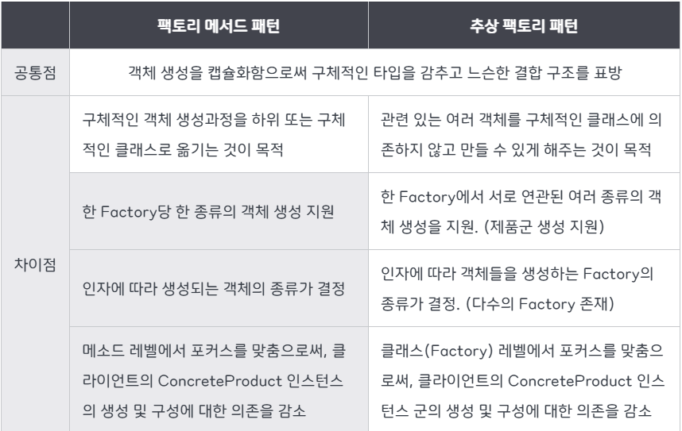

# Factory Method

## 어떻게 사용되는가?

객체 생성을 공장(factory) 클래스로 캡슐화해서 대신 생성하게 하는 패턴이다.

=>클라이언트에서 직접 new 연산자를 통해 제품객체를 만들지 않고 제품 객체를 맡아서 생성하는 공장 클래스(creator)를 만들고, 이를 상속하는 서브 공장 클래스의 메서드(concreteCreator)에 여러가지 제품 객체 생성을 각각 책임지는 것.

## 팩토리 메소드의 구조

- creator : 새로운 제품 객체들을 반환하는 팩토리 메서드를 선언, 주 역할은 제품을 생성한 것이 아니다. 제품과 관련된 비지니스 로직을 처리

- concrete crator : 기초 팩토리 메서드(= concretee)를 override하여 다른 유형의 제품을 반환하도록 한다. 

- product : 인터페이스 선언, 제품에 공통되는 기능들

- concrete product : 제품 구현체

## 왜 사용되어야 하는가

클래스 생성과 사용의 처리 로직을 분리해 결합도를 낮출 수 있어서 사용된다. 

## 언제 적용되는가?

1. 정보 은닉 처리해야 할 경우

2. 기존객체를 재구성하는 대신 기존 객체를 재사용하여 리소스를 절약하고자하는 경우.

## 실제 코드 작성

## 장점, 단점

> 장점

- 단일 책임 원칙 준수: 객체 생성을 코드 한 곳으로 이동해 코드를 유지보수하기 쉽게 할 수 있다.

- 개방 폐쇄 원칙: 기존 코드를 수정하지 않고 새로운 유형의 제품 인스턴스를 프로그램에 도입가능. = 확장성

> 단점
서브 클래스 수가 증가할 수 있고 코드의 복잡도간 늘어난다. 

## 추상팩토리와의 차이점

[참고 자료](https://inpa.tistory.com/entry/GOF-%F0%9F%92%A0-%ED%8C%A9%ED%86%A0%EB%A6%AC-%EB%A9%94%EC%84%9C%EB%93%9CFactory-Method-%ED%8C%A8%ED%84%B4-%EC%A0%9C%EB%8C%80%EB%A1%9C-%EB%B0%B0%EC%9B%8C%EB%B3%B4%EC%9E%90)

[참고 자료 2](https://refactoring.guru/ko/design-patterns/factory-method)

