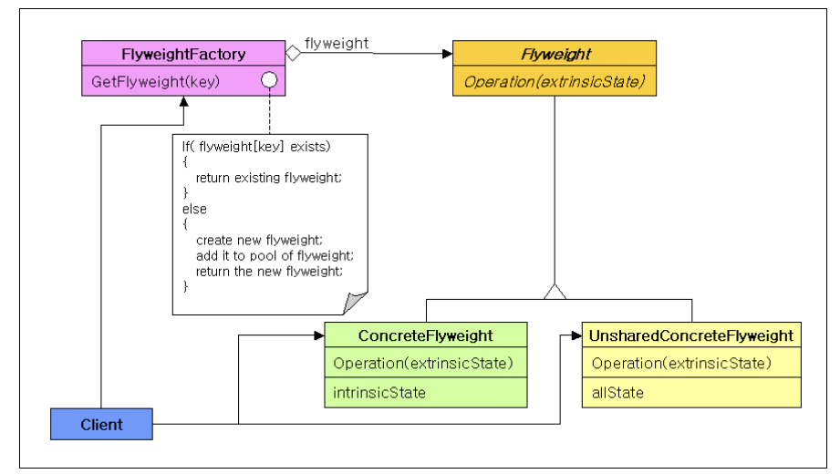

# Flyweight 

수 많은 객체를 생성해야 할때 모든 객체가 공통으로 가지는 상태(intrinsic State)를 공유해 메모리 사용량을 최적화하는 패턴임.

즉, "똑같은 것을 다시 만들지 말고 나눠쓰자"라는 개념.

예를 들어, 숲을 렌더링할 것이다. 숲에는 백만그루의 나무가 필요한데 나무 하나하나가 객체로 표시된다면 많은 양의 RAM을 소모하게 된다. 

나무의 객체는 중복되는 데이터가 존재한다.(ex> 이름, 질감, 색상..)위와 같이 중복되는 값을 flyweight 객체(treeType 클래스)에 저장이 가능하다.

이렇게 되면 나무 위치의 고유의 값을 가진 Tree 클래스는 백만개가 필요하겠지만 나무의 속성 이름, 질감,색상을 포함하고 있는 TreeType 클래스의 호출 횟수를 줄일 수 있다.
만약, 이미 만들어둔 TreeType 클래스가 있다면 있는 값을 사용하게끔 코드를 구현하는 형식이다.

[코드가 길어서 해당 사이트에서 참고](https://refactoring.guru/ko/design-patterns/flyweight/java/example#example-0)

사용되는 클래스를 이미지에 맞게 매칭시켜 본다면,

1. Tree는 ConcreteFlyweight이다. extrinsicState인 외부 좌표값이 들어오는 것을 확인할 수 있음.

2. TreeType이 FlyWeight이다 공유할 상태를 가진 클래스이다. 

3. TreeFactroy가 flyweightfactory이다. 여기서 맵의 형태로 TreeType을 저장해서 중복되는 것을 막는 로직을 구현할 수 있다. 

-------------------------------
-------------------------------
-------------------------------
> 코드 진행 로직

클라이언트에서 flyweigthFactory를 호출해서 TreeType이 있는징 없는지 확인한다. 있으면 기존의 객체를 사용하면된다. 없다면 TreeType클래스를 호출해서 생성해준다. 그값은 해쉬맵의 value 부분에 들어간다.

그리고 Tree는 외부에서 받는 위치값이 필요하기 때문에 각 객체가 고유해야 한다. 하지만 나무 하나하나가 다 다른 것이 아니기 때문에 TreeType으로 중복되는 나무들을 처리해준 것이다.

-------------------------------
-------------------------------
-------------------------------
>>> 추가적인 내용

UnsharedConcreteFlyweight에 대해 예시를 들어서 간단히 설명.

스타크래프트의 유닛 시스템을 예를 들어보겠다. 게임 내에서 만약 수천개의 미네랄이나 총알이 보일떄 모두 객체 자기만의 이미지 데이터를 가지고 있다면 어떻게 될까? 어마어마한 수량에 메모리가 터져버리게 된다.

    //flyweight
    public interface VisualElement {
        // 외적 상태(x, y)를 전달받아 렌더링
        void render(int x, int y, int currentFrame);
        // 메모리 절약을 위해 공유 중인지 확인 (디버깅용)
        boolean isShared();
    }

    //ConcreteFlyweight
    public class SharedUnitModel implements VisualElement {
        private final String name;
        private final List<byte[]> animationFrames; // 수십 MB의 고해상도 이미지 데이터

        public SharedUnitModel(String name, List<byte[]> frames) {
            this.name = name;
            this.animationFrames = frames;
            System.out.println("==> [메모리 로드] 무거운 리소스 로드 완료: " + name);
        }

        @Override
        public void render(int x, int y, int currentFrame) {
            // 실제로는 animationFrames.get(currentFrame)을 사용하여 화면에 그림
            System.out.printf("[공유 객체] %s 그리기 -> 위치: (%d, %d), 프레임: %d%n", name, x, y, currentFrame);
        }

        @Override
        public boolean isShared() { return true; }
    }

    //UnsharedConcreteFlyWeight
    public class UniqueHeroUnit implements VisualElement {
        private final String heroName;
        private final String skinColor; // 영웅마다 다름
        private final List<byte[]> specialEffects; // 영웅 전용 이펙트

        public UniqueHeroUnit(String heroName, String skinColor) {
            this.heroName = heroName;
            this.skinColor = skinColor;
            this.specialEffects = null; // 실제론 영웅 전용 데이터 로드
            System.out.println("==> [독립 생성] 세상에 하나뿐인 영웅 생성: " + heroName);
        }

        @Override
        public void render(int x, int y, int currentFrame) {
            // 인터페이스는 맞췄지만, 내부 로직은 영웅 전용 이펙트를 더해서 그림
            System.out.printf("[비공유 객체] 영웅 %s(%s) 렌더링! 특별 오라 발동 중... 위치: (%d, %d)%n", 
                            heroName, skinColor, x, y);
        }

        @Override
        public boolean isShared() { return false; }
    }

    //flyweightFactory
    public class UnitModelFactory {
        private static final Map<String, SharedUnitModel> cache = new HashMap<>();

        public static VisualElement getSharedModel(String type) {
            if (!cache.containsKey(type)) {
                // 실제 실무라면 DB나 파일 시스템에서 리소스를 읽어옴
                cache.put(type, new SharedUnitModel(type, new ArrayList<>()));
            }
            return cache.get(type);
        }
    }

    //client

    public class GameEngine {
        // 위치값과 모델을 묶어주는 Context 클래스
        static class UnitInstance {
            int x, y;
            VisualElement model;
            UnitInstance(int x, int y, VisualElement model) {
                this.x = x; this.y = y; this.model = model;
            }
        }

        public static void main(String[] args) {
            List<UnitInstance> worldObjects = new ArrayList<>();

            // 1. 일반 유닛 10,000개 생성 (공유 모델 사용)
            VisualElement marineModel = UnitModelFactory.getSharedModel("마린");
            for (int i = 0; i < 10000; i++) {
                worldObjects.add(new UnitInstance(i, i, marineModel));
            }

            // 2. 특수 영웅 유닛 생성 (비공유 모델 사용)
            // 팩토리를 거치지 않고 직접 생성하거나, 팩토리에 특수 메서드를 만듦
            VisualElement jimRaynor = new UniqueHeroUnit("짐 레이너", "Blue-Steel");
            worldObjects.add(new UnitInstance(500, 500, jimRaynor));

            // 3. 렌더링 루프 (협업 시 핵심!)
            // 동료 개발자는 이게 Shared인지 Unshared인지 몰라도 됨. 그냥 그리면 됨.
            System.out.println("--- 렌더링 시작 ---");
            for (UnitInstance unit : worldObjects) {
                unit.model.render(unit.x, unit.y, 1);
                
                // 만약 진짜 특수한 처리가 필요할 때만 체크
                if (!unit.model.isShared()) {
                    // 비공유 객체(영웅)에게만 미니맵에 크게 표시하는 등의 별도 로직
                }
            }
        }
    }

위처럼 코드를 사용하는 이유

- 메모리 효율: SharedUnitModel에 100MB짜리 텍스처가 들어있다면, 1만 명의 마린을 만들어도 메모리는 100MB만 씁니다. 만약 플라이웨이트가 없다면 1,000GB가 필요한 것.

- Unshared의 역할: "모든 것이 공유될 수는 없다"는 현실을 인정하는 구멍입니다. 유저가 커스터마이징한 캐릭터, 보스 몬스터 등은 공유 저장소(Cache)에 넣는 게 오히려 짐이 될 수 있다.

- 협업의 헷갈림 방지: * VisualElement라는 이름의 인터페이스를 통해 **"어쨌든 화면에 그려지는 것들"**로 추상화함.