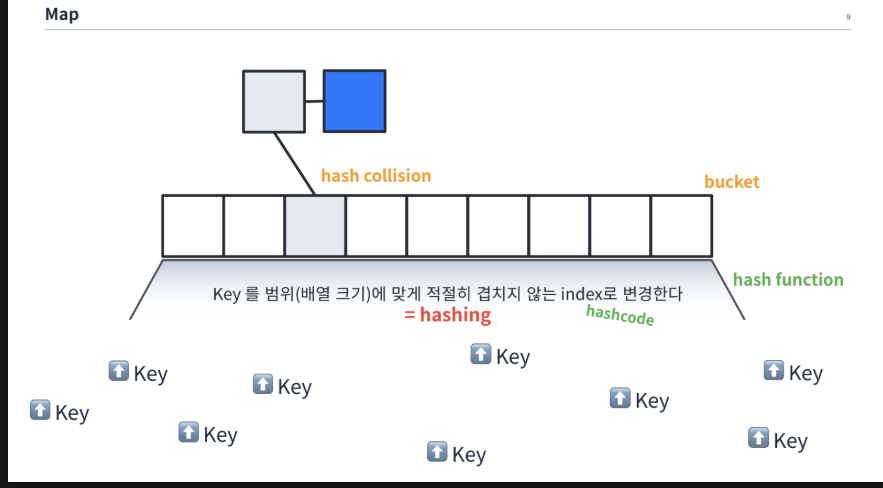

# Map

array는 인덱스로 빠르게 읽기 좋은데 유연하지 못했고 list는 유연하지만 인덱스로 빠르게 읽기는 못한다.

=> 유연하면서도 빠르게 읽어내는 방법이 없을까 생각.

숫자가 아니라(index가 아님) key라고 하는 값을 준다. 그러면 0~n번째 사이의 인덱스에서 key가 매핑되고 매핑된 곳에서 연결된 데이터를 리스트로 사용하면 빨라지지 않을까 생각.

hashing하는 기능을 수행하는 것을 hash function이라고 한다. 
hashfunction에 key값을 넣으면 hash값이 나오고 그 hash값이 인덱스로서 사용된다.  위 이미지의 array를 bucket이라고 부른다. bucket 인덱스의 값에 값을 넣으면 데이터를 추가하는 방식이다. 

여기서 key가 다르지만 hash값이 동일하여 같은 인덱스 위치로 가는 경우가 있다. 이럴때 key는 다르지마 hash값이 충돌했다고 그래서 hash collision이라고 한다. 이렇게 충돌이 되더라도 들어온 데이터는 다 보존이되도록 리스트 형태로 저장한다.

## 간단 정리

배열,리스트의 장점을 모아서 유연하면서도 빠르게 값을 찿아낼 수 있는 것이 맵이다.

> Map에 데이터가 저장되는 순서

    Key -> hash function -> hash -> bucket index -> List(같은 해쉬에 여러개의 데이터 들어올 경우) ->Data

### HashMap 과 HashTable

hashmap은 not synch이다. 스레드 세이프가 필요없을때 
hashtable은 synch이다. 스레드 세이프가 필요할때
concurrentHashMap은 synch하면서 높은 concurrency가 요구될때 hashtable보다 해당 map을 사용해라.

알아두면 좋은 내용.
[hashcode와 equal](https://inpa.tistory.com/entry/JAVA-%E2%98%95-equals-hashCode-%EB%A9%94%EC%84%9C%EB%93%9C-%EA%B0%9C%EB%85%90-%ED%99%9C%EC%9A%A9-%ED%8C%8C%ED%97%A4%EC%B9%98%EA%B8%B0)